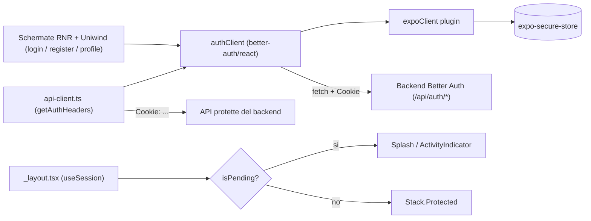

# Better Auth Client per un nuovo progetto Expo

Questo piano serve a replicare in un nuovo progetto Expo l'implementazione client di Better Auth usata in WearWhat.

Scope: solo client mobile Expo. Il backend Better Auth e' considerato gia' esistente e raggiungibile, con `/api/auth/*`, email/password abilitato, cookie di sessione e `trustedOrigins` configurati per lo scheme dell'app.

## Scelte Tecniche

- Struttura cartelle: `src/app`, `src/lib`, `src/components`, alias `@/*` via `tsconfig.json`.
- UI: React Native Reusables + Uniwind.
- Form: `react-hook-form` + `zod` + `@hookform/resolvers`.
- Auth client: `better-auth/react` + `@better-auth/expo/client` + `expo-secure-store`.
- Route guard: `Stack.Protected` di Expo Router + splash/loading mentre `useSession` risolve.
- API protette: header `Cookie` manuale via `authClient.getCookie()` e `credentials: "omit"`.

## Architettura



## Todo di Implementazione

1. Aggiungere dipendenze auth, form e UI.
2. Configurare Uniwind + React Native Reusables.
3. Configurare `.env.local` e `app.json`.
4. Creare `src/lib/auth-client.ts`.
5. Creare `src/lib/api-client.ts`.
6. Implementare `src/app/_layout.tsx` con `useSession`, `isPending` e `Stack.Protected`.
7. Creare `src/app/(auth)/login.tsx`.
8. Creare `src/app/(auth)/register.tsx`.
9. Creare `src/app/private/_layout.tsx` e una schermata `profile.tsx`.
10. Verificare register, login, persistenza sessione, logout e chiamate API protette.

## 1. Dipendenze

Auth:

- `better-auth`
- `@better-auth/expo`
- `expo-secure-store`

Form:

- `react-hook-form`
- `@hookform/resolvers`
- `zod`

UI:

- `uniwind`
- `tailwindcss`
- `react-native-reusables`
- Peer richieste dai componenti scelti, tipicamente `class-variance-authority`, `clsx`, `tailwind-merge` ed eventuali primitive React Native richieste dalla guida RNR.

Note:

- Allineare la major version di `better-auth` tra app mobile e backend.
- Seguire la guida ufficiale di Uniwind per `tailwind.config`, `global.css` e configurazione Metro/Babel.
- Seguire la guida ufficiale di React Native Reusables per inizializzare/copiarne i componenti in `src/components/ui`.

## 2. Variabili d'Ambiente

Creare `.env.local`:

```bash
EXPO_PUBLIC_API_URL=http://YOUR_BACKEND_HOST:3000
```

`EXPO_PUBLIC_API_URL` e' la base URL usata sia dal client Better Auth sia dai client API custom.

## 3. Configurazione `app.json`

Configurare lo scheme dell'app:

```json
{
  "expo": {
    "scheme": "yourapp",
    "userInterfaceStyle": "automatic"
  }
}
```

Lo stesso scheme deve essere accettato dal backend Better Auth in `trustedOrigins`.

## 4. `src/lib/auth-client.ts`

Creare un singleton:

```ts
import { createAuthClient } from "better-auth/react";
import { expoClient } from "@better-auth/expo/client";
import * as SecureStore from "expo-secure-store";

export const authClient = createAuthClient({
  baseURL: process.env.EXPO_PUBLIC_API_URL,
  plugins: [
    expoClient({
      storage: SecureStore,
    }),
  ],
});
```

Punti chiave:

- `expoClient` salva i cookie/sessione nel device tramite `expo-secure-store`.
- Il singleton espone `useSession`, `signIn`, `signUp`, `signOut` e `getCookie`.
- Non istanziare `createAuthClient` dentro componenti React.

## 5. `src/lib/api-client.ts`

Creare un helper condiviso per chiamate API protette:

```ts
import { authClient } from "./auth-client";

export const API_URL = process.env.EXPO_PUBLIC_API_URL;

export async function handleResponse<T>(response: Response): Promise<T> {
  if (!response.ok) {
    const error = await response.json().catch(() => ({ message: "Unknown error" }));
    throw new Error(error.message || `HTTP Error: ${response.status}`);
  }

  return response.json();
}

export function getAuthHeaders(contentType = "application/json"): HeadersInit {
  const cookies = authClient.getCookie();

  return {
    "Content-Type": contentType,
    ...(cookies && { Cookie: cookies }),
  };
}
```

Uso previsto:

```ts
const response = await fetch(`${API_URL}/api/example`, {
  method: "GET",
  headers: getAuthHeaders(),
  credentials: "omit",
});
```

Nota: in React Native non affidarsi a `credentials: "include"` per i cookie. Il pattern del progetto usa `authClient.getCookie()` e inietta manualmente l'header `Cookie`.

## 6. Route Guard in `src/app/_layout.tsx`

Implementare il root layout con loading state:

```tsx
import "../global.css";

import { Stack } from "expo-router";
import { ActivityIndicator, View } from "react-native";
import { authClient } from "../lib/auth-client";

export default function Layout() {
  const { data: session, isPending } = authClient.useSession();

  if (isPending) {
    return (
      <View className="flex-1 items-center justify-center bg-background">
        <ActivityIndicator />
      </View>
    );
  }

  const isAuthenticated = !!session;

  return (
    <Stack>
      <Stack.Protected guard={isAuthenticated}>
        <Stack.Screen name="private" options={{ headerShown: false }} />
      </Stack.Protected>

      <Stack.Protected guard={!isAuthenticated}>
        <Stack.Screen name="index" options={{ headerShown: false }} />
        <Stack.Screen name="(auth)/login" options={{ headerShown: false }} />
        <Stack.Screen name="(auth)/register" options={{ headerShown: false }} />
      </Stack.Protected>
    </Stack>
  );
}
```

Questo evita il flash di route pubbliche/private durante l'idratazione della sessione da `SecureStore`.

## 7. Login

Creare `src/app/(auth)/login.tsx`.

Schema dati:

```ts
import { z } from "zod";

export const loginSchema = z.object({
  email: z.email("Enter a valid email"),
  password: z.string().min(6, "Password must be at least 6 characters"),
});
```

Submit:

```ts
const response = await authClient.signIn.email({
  email: data.email,
  password: data.password,
});

if (response.error) {
  // Mostrare response.error.message tramite toast/banner RNR.
  return;
}

router.replace("/private/today");
```

UI:

- Usare `useForm` con `zodResolver(loginSchema)`.
- Usare `<Controller>` per collegare gli input RNR.
- Disabilitare input e button mentre `isLoading=true`.
- Mostrare errori di validazione vicino ai campi.

## 8. Register

Creare `src/app/(auth)/register.tsx`.

Schema dati:

```ts
import { z } from "zod";

export const registerSchema = z
  .object({
    name: z.string().min(1, "Name is required").min(2, "Name must contain at least 2 characters"),
    email: z.string().min(1, "Email is required").email("Enter a valid email"),
    password: z.string().min(8, "Password must be at least 8 characters"),
    confirmPassword: z.string().min(1, "Confirm password"),
    acceptTerms: z.boolean().refine((value) => value === true, {
      message: "You must accept the terms and conditions",
    }),
  })
  .refine((data) => data.password === data.confirmPassword, {
    message: "Passwords do not match",
    path: ["confirmPassword"],
  });
```

Submit:

```ts
const response = await authClient.signUp.email({
  name: data.name.trim(),
  email: data.email,
  password: data.password,
});

if (response.error) {
  // Mostrare response.error.message.
  return;
}

router.replace("/private/today");
```

Note:

- Better Auth richiede almeno `email`, `password` e `name` per `signUp.email`.
- Dopo registrazione riuscita la sessione viene creata e `useSession` si aggiorna.

## 9. Area Privata

Creare `src/app/private/_layout.tsx`:

```tsx
import { Stack } from "expo-router";

export default function PrivateLayout() {
  return (
    <Stack>
      <Stack.Screen name="(tabs)" options={{ headerShown: false }} />
      <Stack.Screen name="profile" options={{ headerShown: false }} />
    </Stack>
  );
}
```

Creare una schermata `src/app/private/profile.tsx`:

```tsx
import { authClient } from "@/lib/auth-client";
import { useRouter } from "expo-router";

export default function ProfileScreen() {
  const router = useRouter();
  const { data: session } = authClient.useSession();
  const user = session?.user;

  const handleSignOut = async () => {
    const response = await authClient.signOut();

    if (response?.error) {
      // Mostrare response.error.message.
      return;
    }

    router.replace("/");
  };

  // Renderizzare nome, email e bottone "Sign out" con componenti RNR.
}
```

`session.user` espone almeno `name`, `email` e `image` se presenti sul backend.

## 10. Verifica Manuale

- Avviare l'app su simulatore o device.
- Aprire la public landing page.
- Registrare un nuovo utente.
- Verificare il redirect verso `private`.
- Chiudere e riaprire l'app: la sessione deve persistere grazie a `SecureStore`.
- Fare logout da `profile`: l'app deve tornare alle route pubbliche.
- Chiamare un endpoint protetto usando `getAuthHeaders()` e verificare risposta `200`.
- Testare credenziali errate e validazione form.

## Pitfall

- Non creare piu' istanze di `authClient`.
- Non usare `credentials: "include"` come unico meccanismo cookie in React Native.
- Importare `global.css` nel root layout, altrimenti Uniwind non applica le classi.
- Configurare `trustedOrigins` sul backend con lo scheme Expo.
- Verificare che client e server Better Auth siano su versioni compatibili.
- React Native Reusables copia componenti nel progetto: controllare gli import reali in `src/components/ui`.
